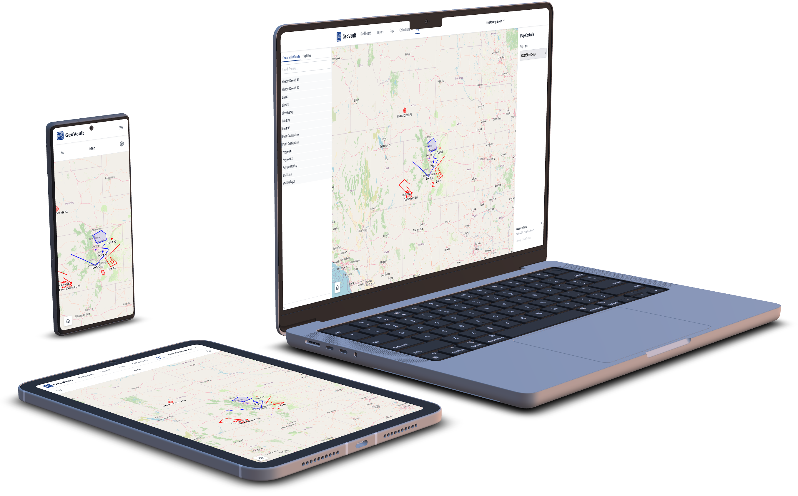

# GeoVault

*Self-hosted platform to organize your personal spatial data in a unified database.*

 

  

 

An outdoorsman tends to collect all sorts of spatial data: tracks of hikes, points of interest, and so on. This data
tends to be scattered across numerous files stored in your documents and it isn't easy to see where you've been.
*GeoVault* is a self-hosted web platform that stores this data and presents *all* of it on one map.

The goal of this project is to automate as much of the pipeline as possible and focus on the user experience. Many GIS
platforms end up extremely complicated. GeoVault aims to automate much of that complication.

User Manual is in `docs/`.

Development is done on my personal Git server, [git.evulid.cc](https://git.evulid.cc/cyberes/geovault), and is mirrored
to [GitHub](https://github.com/Cyberes/geovault). Security practices are described
in [SECURITY.md](https://git.evulid.cc/cyberes/geovault/src/branch/master/SECURITY.md).

**Features:**

- Streamlined upload and import process that makes it easy to shove your spatial data into the database
- KMZ, KML, and GPX files supported
- Tag and collection based organization
- Link-based public sharing
- Reverse geocoding to show what features are associated with
- Heavy data processing behind the scenes
- API key authentication for programmatic access
- Android app for quick file uploads via share intent
- CalTopo account linking to quickly import your data directly from their website
- Extension system to add custom features and integrations
- Collection of useful GIS tools that utilize the existing platform R&D work
- Collaborative live tracking platform with a native Android app.

**This platform does not support editing your tracks or whatever.** Use your own preferred tool and then upload your
data to the server.

## Installation

Installation instructions are in
the [installation/](https://git.evulid.cc/cyberes/geovault/src/branch/master/installation) folder.

## Development

Test files are in the [geovault-tests](https://git.evulid.cc/cyberes/geovault-tests) repository. Please submit issues
on [git.evulid.cc](https://git.evulid.cc/cyberes/geovault).

If you are having issues uploading or importing files, please provide the problem file. You can email it to me if you'd
like.

We have a very thorough test suite in `src/tests` so make sure to run any changes through that. I like to have the AI
write a test for each bug I fix.

## Android Apps

Uploader app that allows you to quickly upload KML/KMZ/GPX files to your GeoVault server via
Android's share intent.

Places app to make it easy to manage and navigate to your bookmarked places. Supports offline usage.

The website also supports PWA installation and can even be set up for the automated compilation of
WebView APKs without Google's minting service (useful for GrapheneOS).

Compiled APKs available here: <https://git.evulid.cc/cyberes/geovault-app-release/releases>

## This software is distributed under the following terms

California results are not authorized to use GeoVault in the state of California effective January 1, 2027. California
law [CA AB1043](https://legiscan.com/CA/text/AB1043/id/3269704) requires a complex age verification system implemented
for software systems with no exceptions for small open source projects.

## Screenshots

