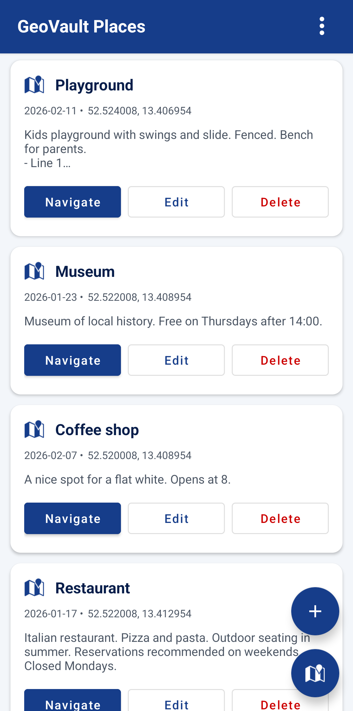

# GeoVault Places App

A native android app for the Places extension to make it easy to quickly reference your places bookmarks. Works offline and caches changes to upload to the server when you get back online.

 

  

 

## Setup

1. Install the APK on your Android device
2. On first launch, configure:
   - **Server URL**: Your GeoVault server URL (e.g., `https://geovault.example.com`)
   - **API Key**: Create an API key from the web interface (Settings → Account Settings → API Keys)

## Building the APK

See the `android-uploader/` app instructions.
