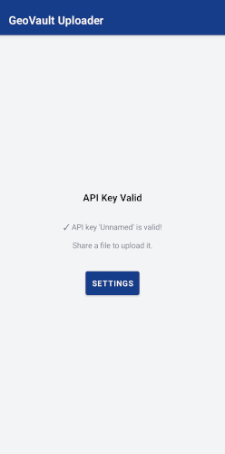

# GeoVault Android Uploader

A minimal Android app for quickly uploading KML/KMZ/GPX files to your GeoVault server via Android's share intent.

<br>

<p align="center">
  
</p>

<br>

## Setup

1. Install the APK on your Android device
2. On first launch, configure:
   - **Server URL**: Your GeoVault server URL (e.g., `https://geovault.example.com`)
   - **API Key**: Create an API key from the web interface (Settings → Account Settings → API Keys)

## Usage

1. Share a KML, KMZ, or GPX file from any app
2. Select "GeoVault Uploader" from the share menu
3. Optionally rename the file (the app automatically appends `_android_upload_<timestamp>` to the filename)
4. Tap "Upload" to send the file to your server

## Building the APK

From the `src/android` directory:

**Debug build (default, faster, no signing required):**
```bash
./build-android.sh
# or explicitly:
./build-android.sh debug
```

**Release build (optimized, requires signing configuration):**
```bash
./build-android.sh release
```

**Clean build outputs:**
```bash
./build-android.sh clean
```

The APK will be generated at:
- Debug: `app/build/outputs/apk/debug/app-debug.apk`
- Release: `app/build/outputs/apk/release/app-release.apk`

**Note:** Debug builds are faster and don't require signing, making them ideal for development and testing. Release builds are optimized and signed for distribution.

## Setting Up Release Signing

To build a signed release APK, you need to set up a keystore file and configure signing credentials:

1. **Generate a keystore file** (one-time setup):
   ```bash
   keytool -genkey -v -keystore app/keystore.jks -keyalg RSA -keysize 2048 -validity 10000 -alias upload
   ```

   This will prompt you for:
   - A password for the keystore (remember this - you'll need it when building)
   - Your name, organizational unit, organization, city, state, and country code
   - A password for the key alias (remember this - you'll need it when building)

2. **Build the signed release APK**:
   ```bash
   ./build-android.sh release
   # or directly:
   ./gradlew assembleRelease
   ```

   When building, you'll be prompted to enter:
   - Your keystore password
   - Your key password

   The keystore path and alias are configured in `gradle.properties` (no passwords are stored there for security).

3. **Optional: use `src/.env` for non-interactive release builds**

   Copy `src/.env.example` to `src/.env` and set:
   - `RELEASE_STORE_FILE` – path to your keystore file (e.g. absolute path).
   - `ANDROID_KEY_PASSWORD_FILE` – (optional) path to a text file containing the keystore password (one line). Use `chmod 600` and keep it outside the repo.

   Then `./build-android.sh release` will use these without prompting. Without `.env`, you can still pass `RELEASE_STORE_PASSWORD` / `RELEASE_KEY_PASSWORD` via the environment or enter them when prompted.
